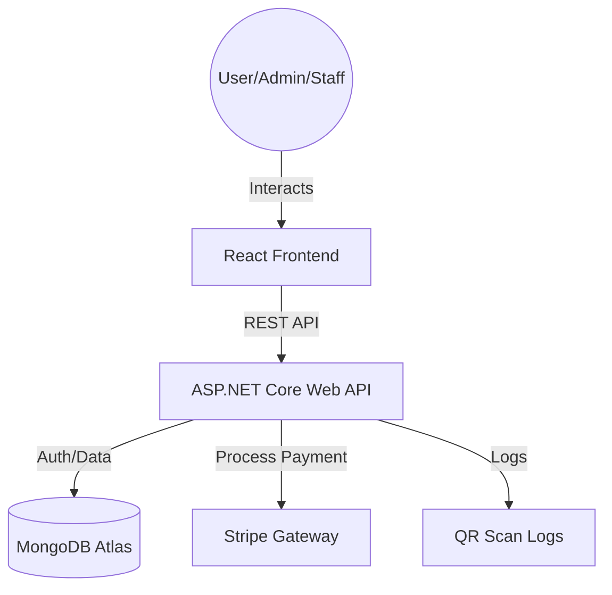
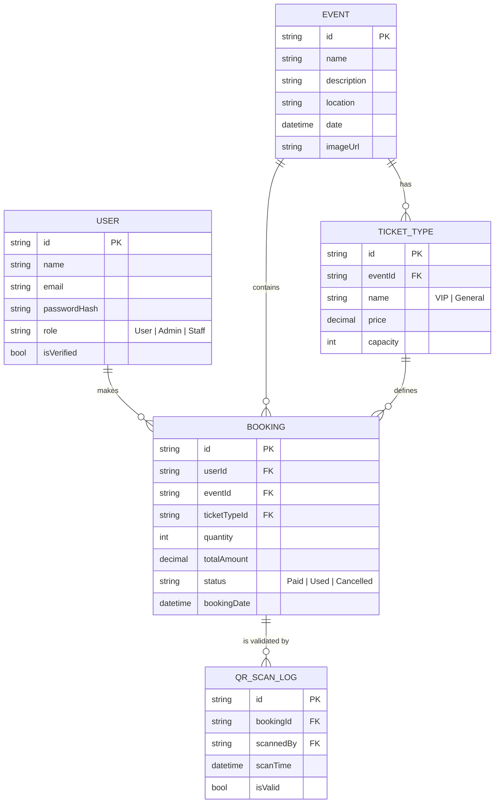
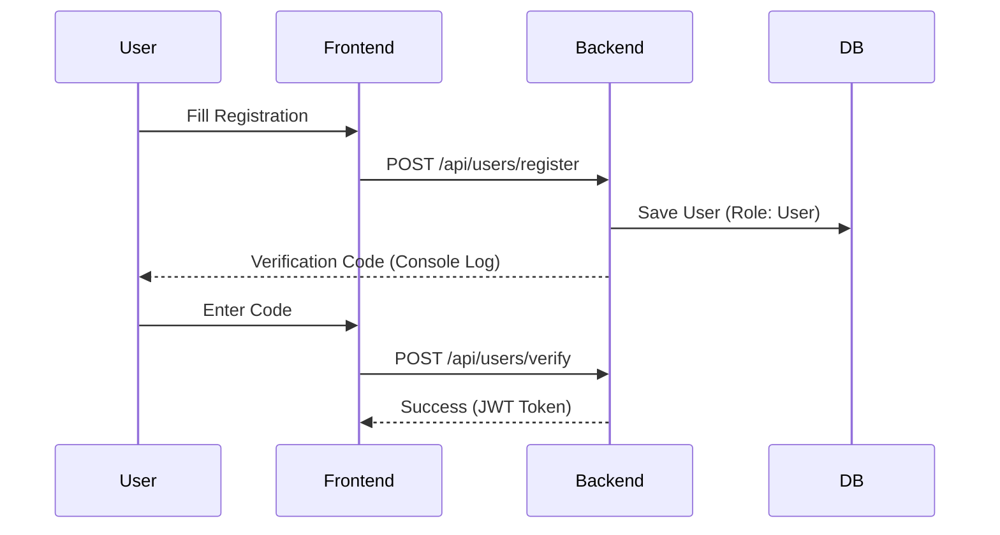
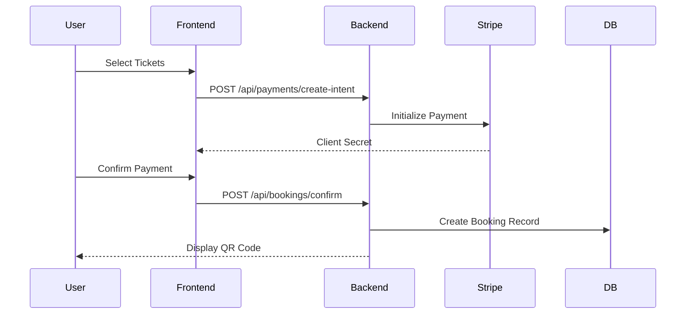
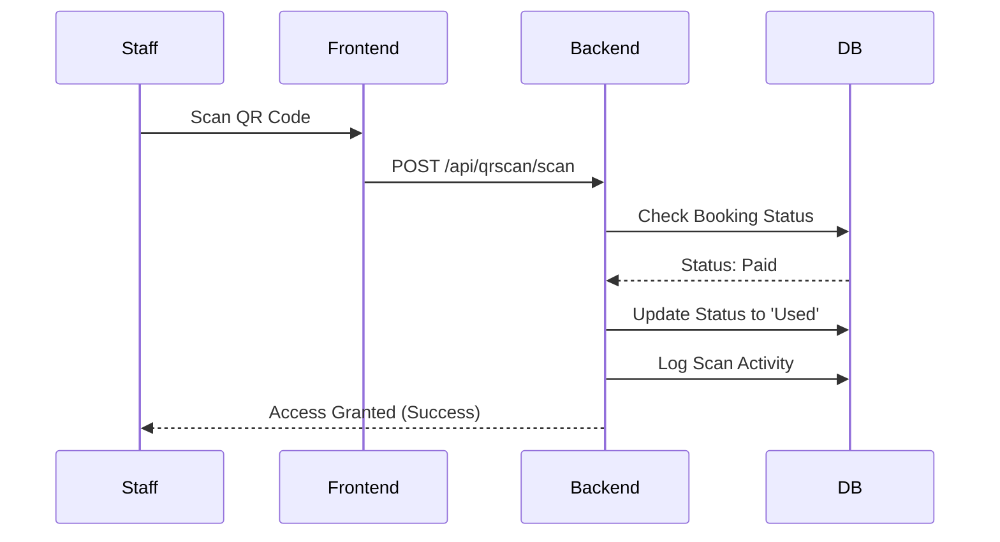

# 🎟️ Ticket Broker - Full-Stack Event Ticketing System
A high-performance, secure, and modern event ticket booking platform built with **ASP.NET Core**, **React**, and **MongoDB**.
### 🔗 Live Links
- **Full Project (Vercel):** [https://ticket-management-system-dusky.vercel.app/](https://ticket-management-system-dusky.vercel.app/)
- **Backend (Render):** [https://ticketmanagementsystem-gqg7.onrender.com](https://ticketmanagementsystem-gqg7.onrender.com)

---
## 📖 Table of Contents
1. [Project Overview](#project-overview)
2. [Key Features](#key-features)
3. [System Architecture](#system-architecture)
4. [Role-Based Access Control](#role-based-access-control)
5. [Tech Stack](#tech-stack)
6. [Database Schema](#database-schema)
7. [Core Workflows](#core-workflows)
8. [Getting Started](#getting-started)
9. [Project Structure](#project-structure)
10. [Future Enhancements](#future-enhancements)
---
## 🌟 Project Overview
Ticket Broker is a comprehensive solution for event organizers and attendees. It provides a seamless flow from event discovery to ticket booking with integrated payment processing and QR-based ticket validation for staff.
---
## 🚀 Key Features
- **User Authentication:** Secure JWT-based registration, login, and email verification.
- **Dynamic Event Discovery:** Browse events with category-based ticket pricing.
- **Secure Payments:** Integrated with Stripe for real-world payment simulation.
- **Staff QR Scanning:** Built-in validation system to redeem tickets at event venues.
- **Admin Dashboard:** Real-time statistics on revenue, users, and ticket sales.
- **Responsive Design:** Fully optimized for mobile and desktop viewing.
---
## 🧠 System Architecture

---
## 👥 Role-Based Access Control (RBAC)
| Feature | Guest | User | Staff | Admin |
| :--- | :---: | :---: | :---: | :---: |
| Browse Events | ✅ | ✅ | ✅ | ✅ |
| View Event Details | ✅ | ✅ | ✅ | ✅ |
| Register / Login | ✅ | ✅ | ✅ | ✅ |
| Book Tickets | ❌ | ✅ | ✅ | ✅ |
| View Personal Tickets | ❌ | ✅ | ✅ | ✅ |
| **Validate/Scan QR Codes** | ❌ | ❌ | ✅ | ✅ |
| **Admin Dashboard (Stats)** | ❌ | ❌ | ❌ | ✅ |
| **Manage Users/Events** | ❌ | ❌ | ❌ | ✅ |
| **Create Staff Accounts** | ❌ | ❌ | ❌ | ✅ |
---
## 🛠️ Tech Stack
### Frontend
- **Framework:** React.js
- **Routing:** React Router DOM
- **State Management:** Hooks (useState, useEffect)
- **Styling:** Vanilla CSS (Custom Glassmorphism Design)
- **HTTP Client:** Axios
### Backend
- **Framework:** ASP.NET Core 8.0 (Web API)
- **Database:** MongoDB (Atlas)
- **Authentication:** JWT (JSON Web Token)
- **Hashing:** BCrypt.Net
- **Payment:** Stripe SDK
---
## 🗄️ Database Schema

---
## 🔄 Core Workflows
### 1. Authentication Process

### 2. Ticket Booking & Payment

### 3. QR Ticket Validation (Staff Mode)

---
## 🛠️ Getting Started
### Prerequisites
- .NET 8.0 SDK
- Node.js (v16+)
- MongoDB Atlas Account (or local MongoDB)
### Backend Setup
1. Navigate to the backend folder:
   ```bash
   cd backend
   ```
2. Restore dependencies:
   ```bash
   dotnet restore
   ```
3. Update `appsettings.json` with your MongoDB connection string and JWT keys.
4. Run the API:
   ```bash
   dotnet run
   ```
   *Swagger documentation will be available at:* `http://localhost:5208/swagger`
### Frontend Setup
1. Navigate to the frontend folder:
   ```bash
   cd frontend
   ```
2. Install dependencies:
   ```bash
   npm install
   ```
3. Start the development server:
   ```bash
   npm start
   ```
   *Frontend will be running at:* `http://localhost:3000`
---
## 📁 Project Structure
```text
TicketBroker/
├── backend/                   # ASP.NET Core API
│   ├── Controllers/           # Admin, Users, Events, Bookings, QRScan
│   ├── Models/                # C# Class Definitions (MongoDB Entities)
│   ├── Services/              # Email & Business Logic
│   └── Data/                  # MongoDbContext
├── frontend/                  # React Application
│   ├── src/
│   │   ├── components/        # Navbar, Footer, ProtectedRoutes
│   │   ├── pages/             # Home, AdminDashboard, StaffDashboard, etc.
│   │   └── api/               # Axios Instance
└── README.md
```
---
## 🔮 Future Enhancements
- **Email Service:** Real SMTP integration for ticket delivery.
- **Analytics:** Advanced charting and graphs for admin reports.
- **Apple/Google Wallet:** Integration for seamless ticket storage.
- **Push Notifications:** Reminders for upcoming events.
---
## 👨‍💻 Author
**Md. Abdullah Al Noman Khan**  
Computer Science & Engineering  
*IUBAT – International University of Business Agriculture and Technology*

**Junaid Hossain
Computer Science & Engineering  
*IUBAT – International University of Business Agriculture and Technology*

**Mim Islam
Computer Science & Engineering  
*IUBAT – International University of Business Agriculture and Technology*
